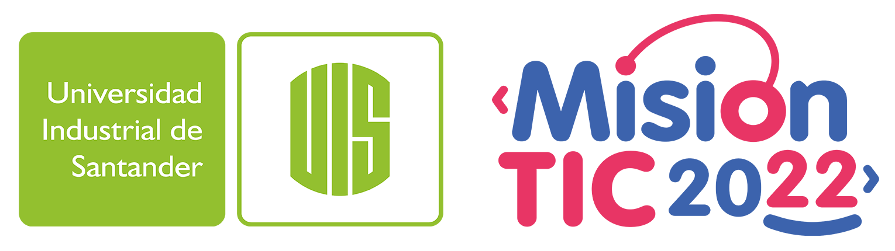

<a name="readme-top"></a>

[![Contributors][contributors-shield]][contributors-url]
[![Forks][forks-shield]][forks-url]

<!-- PROJECT LOGO -->
<br />
<div align="center">
  <a href="https://github.com/joselpulgarin/consultorio">
    
  </a>

  <h3 align="center"> Mision TIC</h3>
  <h3 align="center"> Universidad Industrial de Santander</h3>
  <h4 align="center">Ciclo 3 : Proyecto del curso Desarrollo de Aplicaciones Web.</h4>
  <h4 align="center">TuDoctorOnline - Agendamiento de servicios médicos</h4>

  <p align="center">
    <br />
    <a href="https://github.com/joselpulgarin/consultorio"><strong>Ver Documentos»</strong></a>
    <br />
    <br />
    <!--<a href="https://github.com/joselpulgarin/consultorio">View Demo</a>
    ·
    <a href="https://github.com/joselpulgarin/U19-G10-tudoctor_online/issues">Report Bug</a>
    ·
    <a href="https://github.com/joselpulgarin/U19-G10-tudoctor_online/issues">Request Feature</a>-->
  </p>
</div>

<!-- TABLE OF CONTENTS -->
<details>
  <summary>Tabla de Contenido</summary>
  <ol>
    <li>
      <a href="#descripcion-del-proyecto">Descripcion del proyecto</a>
      <ul>
        <li><a href="#tecnologías-usadas">Tecnologías usadas</a></li>
      </ul>
    </li>
    <li><a href="#colaboradores">Colaboradores</a></li>
    <li>
      <a href="#getting-started">Getting Started</a>
      <ul>
        <li><a href="#prerequisites">Prerrequisitos</a></li>
        <li><a href="#installation">Instalación</a></li>
      </ul>
    </li>
    <li><a href="#usage">Uso</a></li>
    <li><a href="#roadmap">Roadmap</a></li>
    <li><a href="#license">License</a></li>
    <li><a href="#contact">Contact</a></li>
    <li><a href="#acknowledgments">Acknowledgments</a></li>
  </ol>
</details>


<!-- ABOUT THE PROJECT -->
## Descripcion del Proyecto
[![Diagrama ER][diagrama-er]]

<!--
[![Product Name Screen Shot][product-screenshot]]
-->
Debido a la pandemia por la Covid-19, el Ministerio de Salud en conjunto con MinTic han lanzado una convocatoria para automatizar el proceso de atención de los consultorios de medicina general. Su empresa de desarrollo de software desea participar en la convocatoria y, para esto, deberá presentar una propuesta de desarrollo que permita el registro, reserva y consulta de citas médicas, así como la trazabilidad de pacientes y medicamentos formulados.

Objetivos:
* Implementar un software web para un consultorio que permita gestionar la información de agendas y citas médicas para doctores, y el registro de historial médico de los pacientes.
* Implementar la base de datos en un motor de base de datos MySQL
* Gestionar el proceso de desarrollo mediante una herramienta y aplicando la metodología SCRUM

<p align="right">(<a href="#readme-top">back to top</a>)</p>


### Tecnologías Usadas

El desarrollo de la aplicacion web (SaludWeb) se llevo a cabo con apoyo de las siguientes tecnologías: .

* [![Java.com][Java.com]][Java-url]
* [![MySql.com][MySql.com]][MySql-url]
* [![Spring.io][Spring.io]][Spring-url]
* [![Bootstrap.com][Bootstrap.com]][Bootstrap-url]
* [![JQuery.com][JQuery.com]][JQuery-url]
* [![Thymeleaf.org][Thymeleaf.org]][Thymeleaf-url]

<p align="right">(<a href="#readme-top">back to top</a>)</p>

<!-- CONTRIBUTING -->
## Colaboradores
El equipo asignado para este proyecto esta compuesto por:

* [Javier Gordillo](https://github.com/JavierGordillo)
* [Juan Carlos Chaves](https://github.com/juac888)
* [Luis Emilio Rojas](https://github.com/lerfast)
* [Rafael Laverde](https://github.com/Rafaellaverde)
* [Jose Luis Pulgarin](https://github.com/joselpulgarin)


<p align="right">(<a href="#readme-top">back to top</a>)</p>


<!-- GETTING STARTED -->
## Getting Started
-- En Construcción --
<!--
This is an example of how you may give instructions on setting up your project locally.
To get a local copy up and running follow these simple example steps.
-->

### Prerequisites
-- En Construcción --
<!--
This is an example of how to list things you need to use the software and how to install them.
* npm
  ```sh
  npm install npm@latest -g
  ```
-->

### Installation
-- En Construcción --
<!--
_Below is an example of how you can instruct your audience on installing and setting up your app. This template doesn't rely on any external dependencies or services._

1. Get a free API Key at [https://example.com](https://example.com)
2. Clone the repo
   ```sh
   git clone https://github.com/your_username_/Project-Name.git
   ```
3. Install NPM packages
   ```sh
   npm install
   ```
4. Enter your API in `config.js`
   ```js
   const API_KEY = 'ENTER YOUR API';
   ```
-->

<p align="right">(<a href="#readme-top">back to top</a>)</p>


<!-- USAGE EXAMPLES -->
## Usage
-- En Construcción --
<!--
Use this space to show useful examples of how a project can be used. Additional screenshots, code examples and demos work well in this space. You may also link to more resources.

_For more examples, please refer to the [Documentation](https://example.com)_
-->

<p align="right">(<a href="#readme-top">back to top</a>)</p>


<!-- ROADMAP -->
## Roadmap
-- En Construcción --
<!--
- [x] Add Changelog
- [x] Add back to top links
- [ ] Add Additional Templates w/ Examples
- [ ] Add "components" document to easily copy & paste sections of the readme
- [ ] Multi-language Support
    - [ ] Chinese
    - [ ] Spanish

See the [open issues](https://github.com/othneildrew/Best-README-Template/issues) for a full list of proposed features (and known issues).
-->

<p align="right">(<a href="#readme-top">back to top</a>)</p>


<!-- LICENSE -->
## License
-- En Construcción --
<!--
Distributed under the MIT License. See `LICENSE.txt` for more information.
-->

<p align="right">(<a href="#readme-top">back to top</a>)</p>


<!-- CONTACT -->
## Contact
-- En Construcción --
<!--
Your Name - [@your_twitter](https://twitter.com/your_username) - email@example.com

Project Link: [https://github.com/your_username/repo_name](https://github.com/your_username/repo_name)
-->

<p align="right">(<a href="#readme-top">back to top</a>)</p>


<!-- ACKNOWLEDGMENTS -->
## Acknowledgments
-- En Construcción --
<!--
Use this space to list resources you find helpful and would like to give credit to. I've included a few of my favorites to kick things off!

* [Choose an Open Source License](https://choosealicense.com)
* [GitHub Emoji Cheat Sheet](https://www.webpagefx.com/tools/emoji-cheat-sheet)
* [Malven's Flexbox Cheatsheet](https://flexbox.malven.co/)
* [Malven's Grid Cheatsheet](https://grid.malven.co/)
* [Img Shields](https://shields.io)
* [GitHub Pages](https://pages.github.com)
* [Font Awesome](https://fontawesome.com)
* [React Icons](https://react-icons.github.io/react-icons/search)
-->

<p align="right">(<a href="#readme-top">back to top</a>)</p>


<!-- MARKDOWN LINKS & IMAGES -->
[contributors-shield]: https://img.shields.io/github/contributors/joselpulgarin/consultorio.svg?style=for-the-badge
[contributors-url]: https://github.com/joselpulgarin/consultorio/graphs/contributors
[forks-shield]: https://img.shields.io/github/forks/joselpulgarin/consultorio.svg?style=for-the-badge
[forks-url]: https://github.com/joselpulgarin/consultorio/network/members
[product-screenshot]: images/screenshot.png
[diagrama-er]: images/ERDDiagram.png
[Java.com]: https://img.shields.io/badge/Java-Java-green?style=plastic
[Java-url]: https://www.java.com/es/
[Spring.io]: https://img.shields.io/badge/Springboot-6DB33F?style=plastic&logo=springboot&logoColor=white
[Spring-url]: https://spring.io/projects/spring-boot/
[Bootstrap.com]: https://img.shields.io/badge/Bootstrap-563D7C?style=plastic&logo=bootstrap&logoColor=white
[Bootstrap-url]: https://getbootstrap.com
[JQuery.com]: https://img.shields.io/badge/jQuery-0769AD?style=plastic&logo=jquery&logoColor=white
[JQuery-url]: https://jquery.com 
[Thymeleaf.org]: https://img.shields.io/badge/Thymeleaf-6DB33F?style=plastic&logo=thymeleaf&logoColor=white
[Thymeleaf-url]: https://www.thymeleaf.org/
[MySql.com]: https://img.shields.io/badge/MySql-4479A1?style=plastic&logo=mysql&logoColor=white
[MySql-url]: https://www.mysql.com/

